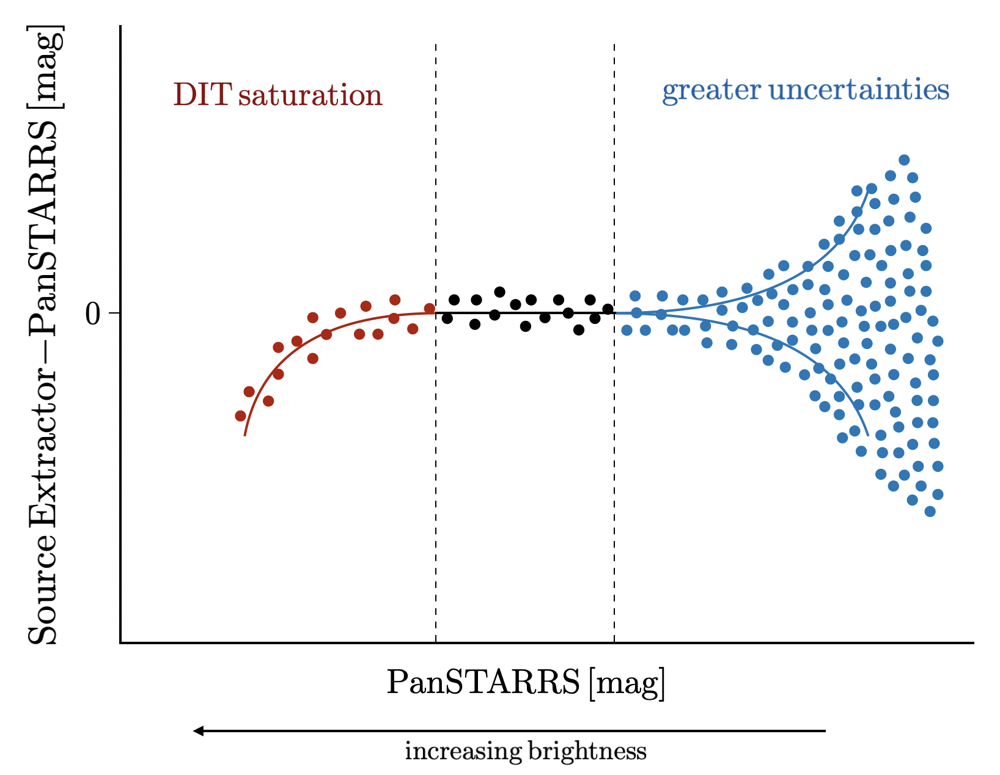

# DIT Photometry Data Reduction and Calibration

This repository contains my code for reducing and calibrating the DIT photometric observations of W3.

## About DIT
The Dunlap Institute Telescope (DIT) is a 1 m telescope that observed W3 from Mexico. Observing was led by Suresh Sivanandam and Nick Law. Natalie Price-Jones and Jielai Zhang reduced and calibrated the Dragonfly photometric data which some of this is based on.

## Data Reduction

### Astrometric Solution
Use [Astrometry.net](astrometry.net) to obtain an astrometric solution for each image.

### 2. Dark subtraction
Must first be bias-subtracted.

### 3. Flat Fielding

## Calibration
We use Pan-STARRS data to calibrate the DIT photometry.

